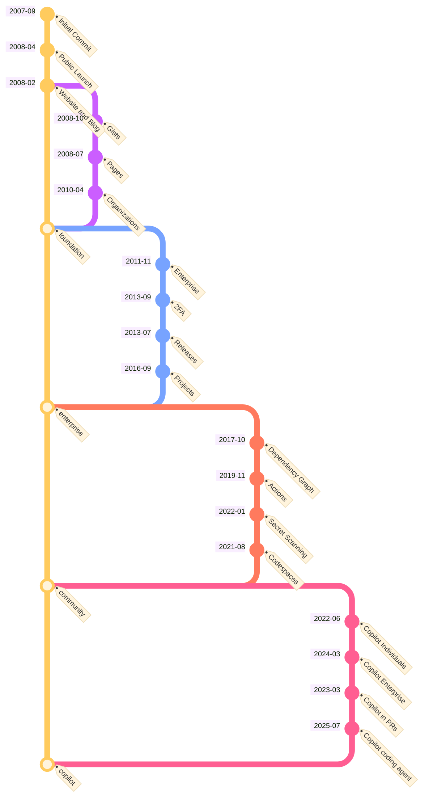

## The Sacred Mainline of Codia

```mermaid
---
config:
  theme: 'base'
  gitGraph:
    showBranches: false
    rotateCommitLabel: false
---
gitGraph TB:

commit id: "2007-09" tag: "Initial Commit"
commit id: "2008-04" tag: "Public Launch"
commit id: "2008-02" tag: "Website and Blog"

branch foundation-1
commit id: "2008-10" tag: "Gists"
commit id: "2008-07" tag: "Pages"
commit id: "2010-04" tag: "Organizations"
checkout main
merge foundation-1 tag: "foundation"

branch enterprise-expansion-2
commit id: "2011-11" tag: "Enterprise"
commit id: "2013-09" tag: "2FA"
commit id: "2013-07" tag: "Releases"
commit id: "2016-09" tag: "Projects"
checkout main
merge enterprise-expansion-2 tag: "enterprise"

branch community-scalability-3
commit id: "2017-10" tag: "Dependency Graph"
commit id: "2019-11" tag: "Actions"
commit id: "2022-01" tag: "Secret Scanning"
commit id: "2021-08" tag: "Codespaces"
checkout main
merge community-scalability-3 tag: "community"

branch copilot-enablement-4
commit id: "2022-06" tag: "Copilot Individuals"
commit id: "2024-03" tag: "Copilot Enterprise"
commit id: "2023-03" tag: "Copilot in PRs"
commit id: "2025-07" tag: "Copilot coding agent"
checkout main
merge copilot-enablement-4 tag: "copilot"
```
