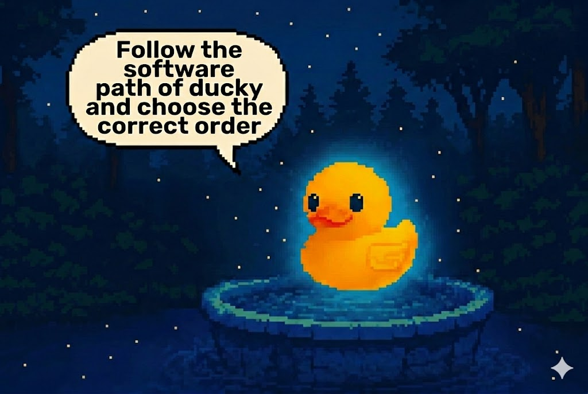

## Ducky Match Game

Match the pairs by uncovering all 6 cards.

**Edit this comment** so each card contains one image URL.  
Use these three images, with **each image used exactly 2 times**:

### Uncovered Cards

- Card 1: `HIDDEN`
- Card 2: `HIDDEN`
- Card 3: `HIDDEN`
- Card 4: `HIDDEN`
- Card 5: `HIDDEN`
- Card 6: `HIDDEN`

Having trouble? 🤷
 

> - 💡 **Tip:** Replace each `HIDDEN` value with one image URL.
> - 💡 **Tip:** The check passes only when all 6 cards are filled and each image appears exactly twice.

