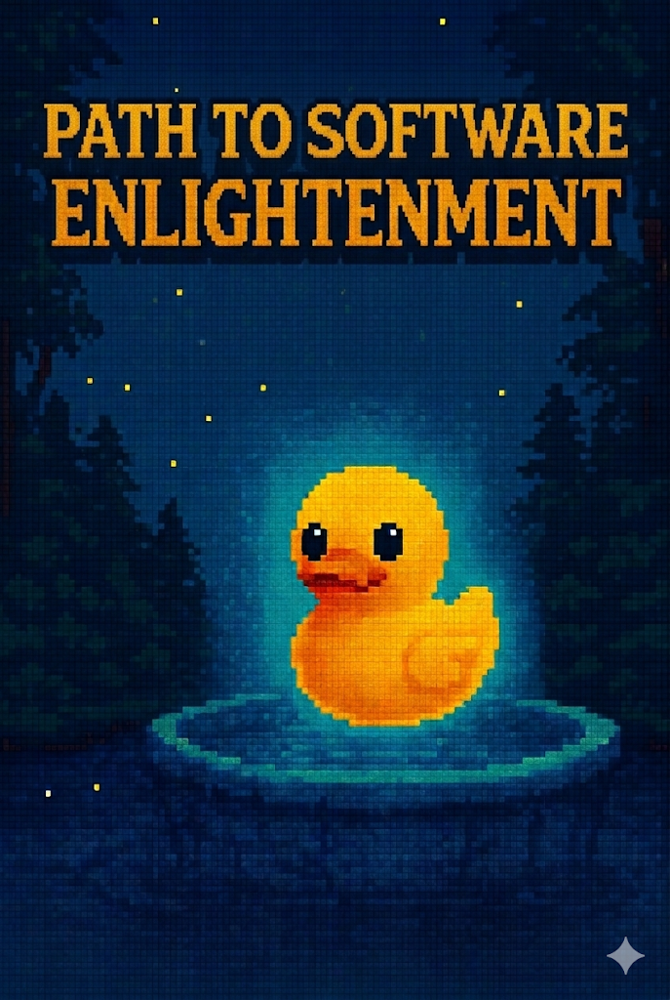
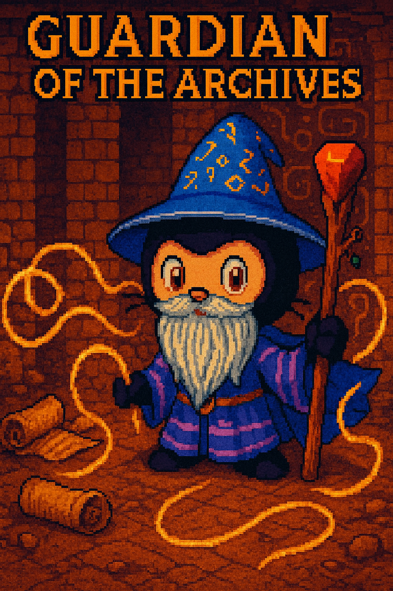

## Ducky Match Game

Match the pairs by uncovering all 6 cards.

**Edit this comment** so each card contains one image URL.  
Use these three image URLs, with **each image used exactly 2 times**:

`https://github.com/user-attachments/assets/c9d4a45b-5e71-4d34-8aab-1cb28ecca8cb`
`https://github.com/user-attachments/assets/062f5275-7e33-4355-85ef-fc958433df81`
`https://github.com/user-attachments/assets/37302691-a101-4436-8336-7c0c991ad05d`

Example format:

``

### Uncovered Cards

- Card 1: `HIDDEN`
- Card 2: `HIDDEN`
- Card 3: `HIDDEN`
- Card 4: `HIDDEN`
- Card 5: `HIDDEN`
- Card 6: `HIDDEN`

Having trouble? 🤷
 

> - 💡 **Tip:** Replace each `HIDDEN` value with one image URL.
> - 💡 **Tip:** The check passes only when all 6 cards are filled and each image appears exactly twice.

