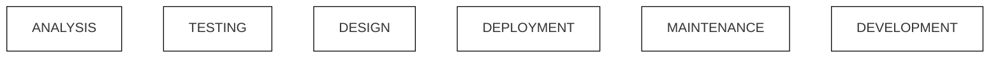

## Software Developer Lifecycle

The mermaid diagram below shows the stages of a **Software Developer Lifecycle**, but they are in the **wrong order**!

**Edit this comment** and reorder the stages in the mermaid diagram so they are in the correct order.

Having trouble? 🤷
 

> 💡 **Tip:** Edit the labels inside the `[ ]` brackets in the mermaid code block to put the stages in the correct order!
> 💡 **Tip:** Copy the line with the `[ ]` and just edit what is inside the box!
> 💡 **Tip:** Make sure the text inisde `[ `] is exactly the same!

