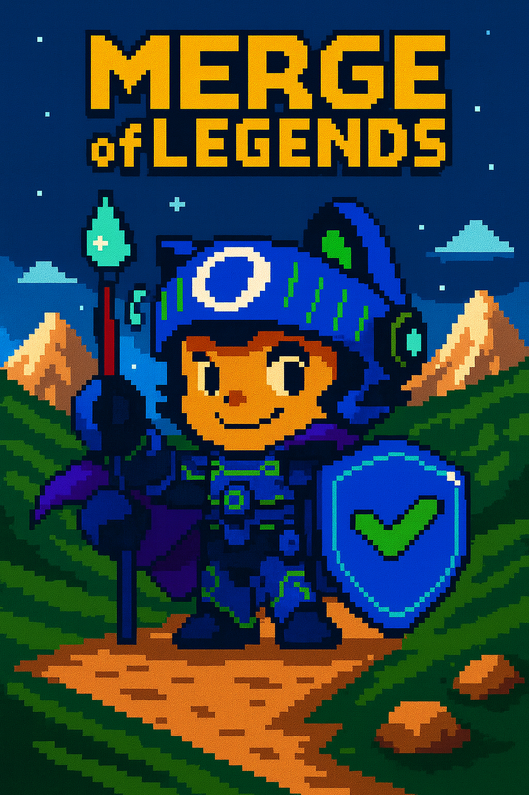

# Merge of Legends

Save the land of Codia and restore the sacred Mainline with the help of three mythical creatures and their gifts.

- Pick one of three journeys (Ducky, Mona, Copilot).
- Solve mini challenges (about 5 minutes).
- Combine powers and save the world.

### How to host this game

Use the below button to copy the game to a demo account. Wait **about 20 seconds** for the issue to be created.

> [!CAUTION]
> If setting it up on multiple computers, copy the game to a unique GitHub handle for each computer.
> Otherwise, players will be opening the same issue and confusing each other.

### How to play again

The game will automatically reset when a user finishes.

1. After a user finishes the issue, it is automatically closed.
2. A workflow ensures there is exactly one open quest issue and links it in a comment on the closed issue.
3. A moderator navigates to the **Issues** tab and opens the new issue.
4. The computer is assigned a new person to play the game.
